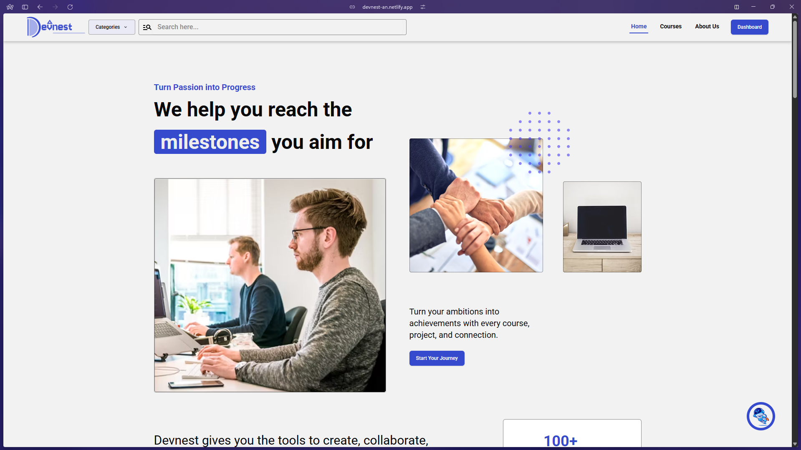
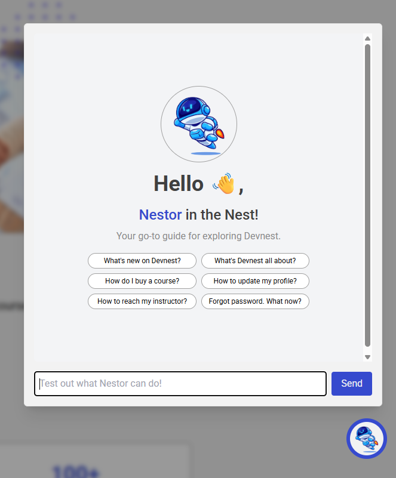
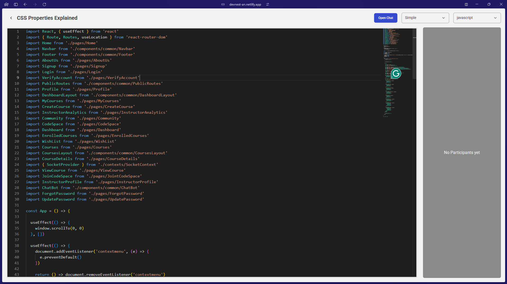
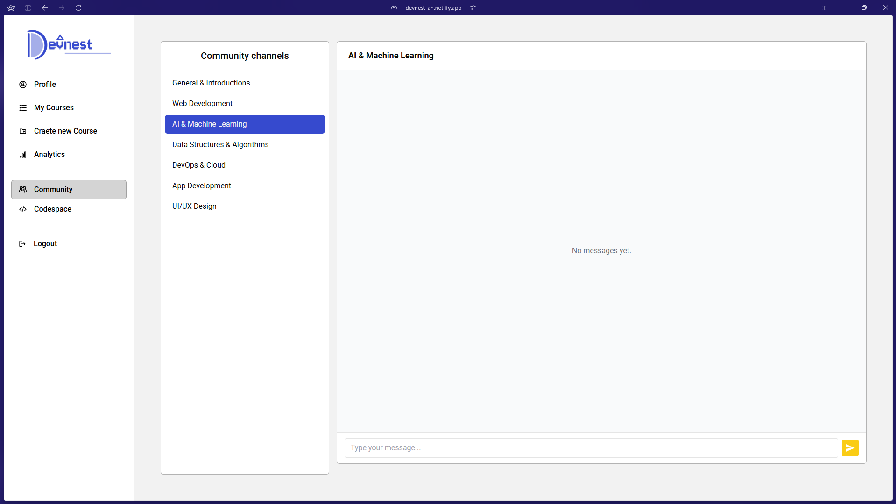
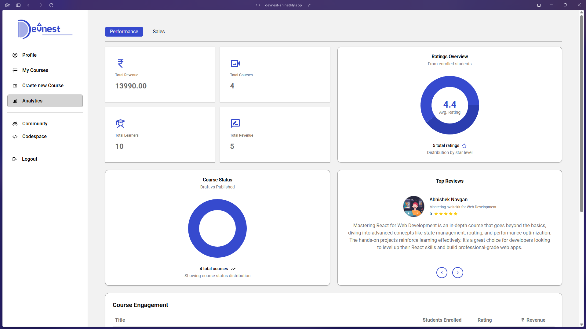

# 🚀 Devnest – Developer-Centric Learning Platform

Devnest is an AI-powered full-stack platform designed to enhance the learning experience for developers. It enables real-time collaboration, structured course learning, community interaction, and intelligent assistance through an integrated AI bot.

> 🔗 **Live Site**: [https://devnest-an.netlify.app/](https://devnest-an.netlify.app/)  
> 🔧 **Backend Repo**: [Devnest Backend](https://github.com/your-username/devnest-backend)

---

## 📌 Table of Contents

- [Features](#-features)
- [Tech Stack](#-tech-stack)
- [Project Snapshots](#-project-snapshots)
- [Installation](#-installation)
- [Folder Structure](#-folder-structure)
- [Future Scope](#-future-scope)
- [Contributing](#-contributing)
- [License](#-license)

---

## 🔥 Features

- 🧑‍🏫 **Role-Based Access Control (RBAC)** – Superadmin, Admin, Instructor, and Student roles.
- 📚 **Course Management** – Add/edit courses with sections, subsections, and video lectures.
- 🧠 **AI Assistant (Nestor)** – AI-powered chatbot that helps users navigate, explore courses, and solve programming doubts.
- 💬 **Community Chat Forums** – Public chat rooms for peer discussions.
- 💻 **Codespace** – Real-time collaborative code editor with chat, role permissions, and invite access.
- 🎥 **Chunked Video Streaming** – Cloudinary-powered streaming with piracy protection.
- 💸 **Payments Integration** – Razorpay gateway for seamless course purchases.
- 📈 **Instructor Analytics** – Sales, ratings, and progress tracking dashboards.
- 📩 **OTP-based Auth & Mailing** – Secure authentication using Nodemailer + OTP system.
- 🔐 **JWT Authentication** – Auth secured via tokens and Axios interceptors.

---

## 🛠️ Tech Stack

### 🔹 Frontend
- **React.js 19**
- **Tailwind CSS** + **Radix UI**
- **Zustand** – Global state management
- **React Router DOM** – Routing
- **Framer Motion** – Animations
- **React Hook Form + Zod** – Form handling and validation
- **TanStack Query** – Server state/data fetching
- **Socket.IO Client** – Real-time communication
- **Monaco Editor** – Collaborative coding editor

### 🔹 Backend
- **Node.js + Express.js**
- **MongoDB + Mongoose**
- **JWT & Bcrypt** – Auth and password security
- **Socket.IO** – Real-time messaging and codespaces
- **Razorpay** – Payments
- **Cloudinary** – Image and video CDN
- **Nodemailer + OTP Generator** – Mailing & verification
- **Google Gemini API** – AI integration (Nestor bot)

---

## 🖼️ Project Snapshots

| Home Page | Nestor (AI Assistant) | Codespace | Community Chat | Dashboard |
|-----------|--------------|-----------|-----------|-----------|
|  |  |  |  |  |

---

## 🚀 Installation

```bash
# Clone the repo
git clone https://github.com/AbhishekNavgan95/Devnest
cd Devnest

# Install dependencies
npm install

# Start the dev server
npm run dev
```

Make sure to set up the backend from the Devnest Backend Repo and configure .env for API base URLs.

## 🚀 Folder Structure

```
devnest-frontend/
│
├── public/                      # Static assets (favicon, robots.txt, etc.)
│
├── src/                         # Source code
│   ├── assets/                  # Logos, images, static files
│   ├── components/              # Reusable UI components
│   ├── contexts/                # React context providers
│   ├── hooks/                   # Custom React hooks
│   ├── lib/                     # API connectors, utilities
│   ├── pages/                   # Page-level components and routes
│   ├── stores/                  # Zustand state management stores
│   ├── App.jsx                  # Root component
│   ├── index.css                # Global styles
│   ├── main.jsx                 # Entry point
│
├── .env                         # Environment variables
├── .gitignore                   # Git ignored files
├── components.json              # Radix UI config (if applicable)
├── eslint.config.js             # Linting rules
├── index.html                   # HTML entry template for Vite
├── jsconfig.json                # JS path resolution config
├── netlify.toml                 # Netlify deployment settings
├── package.json                 # Project metadata and dependencies
├── package-lock.json            # Exact dependency versions
├── postcss.config.js            # PostCSS configuration
├── tailwind.config.js           # Tailwind CSS configuration
├── vite.config.js               # Vite build tool configuration
└── README.md                    # Project documentation
```

## 🧭 Future Scope

- Resource vaults for downloadable materials
- Event calendar for hackathons, meetups, webinars
- Coding challenge leaderboard module
- AI-based lecture summaries
- Certificate generation system
- Instructor-led public video channel (YouTube-style)
- Offline video access with secure caching


## 🤝 Contributing
Feel free to fork this project, submit issues or pull requests. All contributions are welcome! 😊

## 📄 License
This project is licensed under the MIT License.

Created with ❤️ by Abhishek R. Navgan
